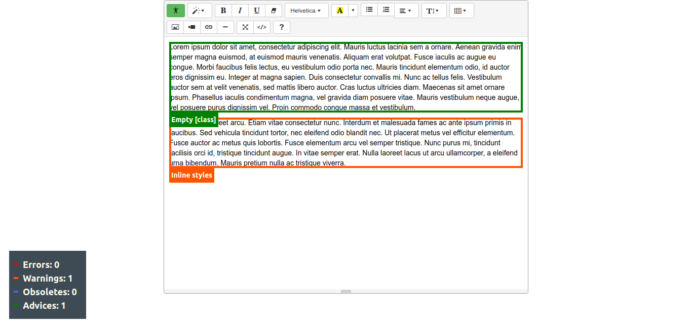

# summernote-a11y
Unobtrusive Accessibility Checker Plugin for Summernote WYSIWYG the uses CSS

This Plugin uses a modified version of the CSS rules from [a11y.css](https://github.com/ffoodd/a11y.css) to check the Accessibility of the content in the Summernote Editor Area.




### Installation

#### 1. Include JS

Include the following code after Summernote:

```html
<script src="summernote-a11y.js"></script>
```

#### 2. Supported languages

Currently available in English!

#### 3. Summernote options

```javascript
$('.summernote').summernote({
    toolbar:[
        ['a11y',['a11y']], // The Button
        ['style',['style']],
        ['font',['bold','italic','underline','clear']],
        ['fontname',['fontname']],
        ['color',['color']],
        ['para',['ul','ol','paragraph']],
        ['height',['height']],
        ['table',['table']],
        ['insert',['media','link','hr']],
        ['view',['fullscreen','codeview']],
        ['help',['help']]
    ],
    a11y:{
      langFile: '[folder]/lang/en-US.css' // This is the location to your CSS Language file.
    }
});
```

#### 4. Check out our other Summernote Plugins via our main Github page.
- [Diemen Design](https://github.com/DiemenDesign/)
